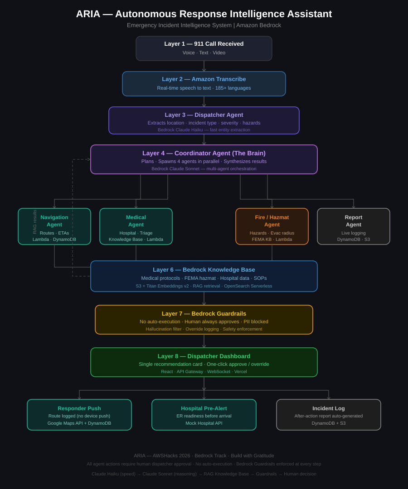

<div align="center">

# ARIA

### **Autonomous Response Intelligence Assistant**

> *A real-time AI co-pilot for 911 dispatchers. Every second costs a life. We built an AI that thinks in milliseconds.*

[](https://aws.amazon.com/)
[](https://aws.amazon.com/bedrock/)
[](https://react.dev/)
[](https://python.org/)
[](LICENSE)

</div>

---

## Why We Built This

911 dispatchers are the invisible first responders. You never see them on the news. They never get the parade. But they are the voice that holds you together in the worst moment of your life, and they do it alone, under pressure, with tools that were never built to help them think.

**ARIA exists to give dispatchers the backup they have never had.**

Not a better data screen. Not a smarter CAD system. A real-time thinking partner that listens alongside the dispatcher, processes everything simultaneously, handles backend coordination in the background, and surfaces a single clear recommendation so the human can stay focused on the one thing that matters: the person on the other end of the line.

**ARIA is a co-pilot. The dispatcher is always the pilot.**

---

## The Four Problems

### 1. One Person. Every Task. All at Once.

In the next 90 seconds of a 911 call, a single dispatcher has to:
- Keep the caller calm and extract coherent information from someone panicking
- Identify incident type, severity, and exact location from fragmented speech
- Search unit availability and calculate the closest unit with live traffic
- Cross-reference hospital specialties and bed availability
- Figure out if hazmat, fire, or additional backup is needed
- Type everything into CAD in real time, while still on the call

There is no second person helping them think. **ARIA runs all of this in parallel** the moment the call starts.

### 2. Human Error Is System Design Failure

Dispatchers make mistakes not because they are unqualified, but because the conditions make errors structurally inevitable:
- **Fatigue:** Centers running 25-35% below safe staffing, mandatory overtime standard
- **Cognitive overload:** Managing multiple active calls, radio traffic, and CAD input simultaneously
- **Decision pressure:** In cardiac arrest, there is no time to second-guess
- **Information gaps:** Panicked callers give incomplete information; dispatchers fill gaps from experience, sometimes incorrectly

**ARIA brings verification and grounding to every decision.** Every recommendation is grounded in authoritative source documents like FEMA ERG, AHA protocols, and MPDS triage guidelines. The system catches errors that happen when human judgment operates under impossible conditions.

### 3. Emergencies Evolve Faster Than Any System Can Batch

An emergency is not static. What starts as a medical call becomes a crime scene when the dispatcher hears a gunshot. What sounds like a minor car accident becomes a multi-vehicle pile-up with fuel spillage.

Current systems are built for discrete packets of information. **ARIA's Stream Processor reacts to every word the moment it is spoken.** Domain watchers fire agents in real time, and the recommendation card updates as the situation evolves. Human judgment combined with machine speed.

### 4. Backend Coordination Is Invisible Work That Costs Lives

While managing an active call, dispatchers must simultaneously:
- Call hospitals to check trauma bay availability
- Radio for backup units when calls escalate
- Contact hazmat teams to confirm they have the right equipment
- Reach out to secondary hospitals when the first is at capacity

All of this is manual. Every split in attention is a moment they are not listening to the caller. **ARIA moves backend coordination entirely off the dispatcher's plate.** The Medical Agent sends the hospital pre-alert during the call. The Navigation Agent calculates backup options in real time. The dispatcher sees the result, not the process.

---

## Architecture

<p align="center">
  
</p>

### How It All Fits Together

| Layer | Component | What It Does |
|-------|-----------|-------------|
| **1. Input** | Pre-recorded 911 Call Audio | Entry point. Real emergency audio validates the speech-to-intelligence pipeline. |
| **2. Transcription** | Amazon Transcribe Streaming | Converts voice to live text word by word. Supports 185+ languages. |
| **3. Stream Processor** | AWS Lambda (`aria-stream-processor`) | The real-time spine. Broadcasts words, runs domain watchers, fires agents asynchronously. |
| **3.5. Verifier** | Claude Haiku 3.5 | Parallel verifier that never blocks. Resolves ambiguities and enriches context mid-run. |
| **4. Coordinator** | Claude Sonnet 4 | Synthesis intelligence. Reconciles agent outputs, streams partial results, produces the final recommendation card. |
| **5. Specialist Agents** | Navigation, Medical, Fire/Hazmat, Report | Four Bedrock agents running in parallel, each with domain-specific tools and Knowledge Base access. |
| **6. Knowledge Base** | Bedrock KB + Titan Embeddings v2 | RAG over authoritative emergency protocols: MPDS, FEMA ERG, AHA guidelines. |
| **7. Guardrails** | Amazon Bedrock Guardrails | Hard safety enforcement. No auto-execution, PII blocking, hallucination filtering. |
| **8. Dashboard** | React + WebSocket + Mapbox | Progressive rendering. Information appears field by field as agents complete. |
| **9. Outputs** | Logs + Mock Hospital | Route assignment logged, hospital pre-alert sent, after-action report auto-generated. |

---

## What ARIA Does

### Real-Time Word-by-Word Intelligence
The Stream Processor receives every word from Transcribe in under 300ms and immediately broadcasts it to the dashboard while running domain watchers in-process. No batching. No buffering. No waiting.

### Progressive Recommendation Card
The dispatcher never sees a loading spinner. Information appears independently as each agent completes:
- **T + 0.3s** - First transcript words scrolling
- **T + 6-8s** - Navigation Agent returns: unit, ETA, route on map. Critical incidents get "Dispatch Unit Now"
- **T + 8-10s** - Medical Agent returns: hospital, ER status
- **T + 10-12s** - Hazmat Agent returns (if applicable): hazard warnings
- **T + 12-15s** - Full recommendation card ready with "Approve All"

### Four Specialist Agents (Parallel)
- **Navigation Agent** - Real-time unit lookup, live traffic ETAs via Google Maps API, turn-by-turn route generation
- **Medical Agent** - Triage protocol retrieval, closest capable hospital identification, automated hospital pre-alert
- **Fire/Hazmat Agent** - Chemical identification, FEMA ERG lookup, evacuation radius calculation, protective gear recommendations
- **Report Agent** - Live incident logging, automated after-action report generation with full timeline

### Human-in-the-Loop Safety
- **No auto-execution.** Every dispatch, every hospital alert, every route push requires explicit dispatcher approval
- **Override logging.** Every human override is captured with timestamp for post-incident review
- **Hallucination filtering.** All medical dosages, chemical data, and routing instructions are checked against grounded Knowledge Base sources
- **PII blocking.** Caller data never surfaces outside the secure dashboard

### Multi-Source Incident Intelligence (Roadmap)
When 15 callers report the same highway pile-up, each sees a different part. ARIA's vision is a live knowledge graph that aggregates information from every linked call, so the dispatcher on call #7 already knows about the fuel leak from call #3 and the trapped passenger from call #9.

---

## Tech Stack

### Core AI Engine
| Service | Purpose |
|---------|---------|
| Amazon Bedrock (Claude Haiku 3.5) | Fast real-time verifier with sub-second latency |
| Amazon Bedrock (Claude Sonnet 4) | Coordinator synthesis and specialist agent reasoning |
| Amazon Bedrock Agents | Six purpose-built agents with system prompts and tool bindings |
| Amazon Bedrock Knowledge Base | RAG over emergency protocols with Titan Embeddings v2 |
| Amazon Bedrock Guardrails | Hard safety enforcement across all agents |

### Real-Time Pipeline
| Service | Purpose |
|---------|---------|
| Amazon Transcribe Streaming | Live speech-to-text, 185+ languages |
| AWS Lambda (10 functions) | Serverless compute for all agent tools and APIs |
| Amazon API Gateway (REST + WebSocket) | REST endpoints and live dashboard WebSocket spine |
| Amazon DynamoDB | Incidents, units, hospitals, overrides, WebSocket connections |
| Amazon S3 | Knowledge Base documents, transcripts, after-action reports |

### Frontend
| Technology | Purpose |
|------------|---------|
| React + Tailwind CSS | Dispatcher dashboard with progressive rendering |
| Mapbox GL JS | Live map with unit locations, incident markers, route polylines |
| Vercel | Edge-deployed static hosting |

---

## Cost Profile

| Service | Estimated Cost per 1,000 Incidents |
|---------|-----------------------------------|
| Amazon Transcribe Streaming | ~$2.40 |
| Bedrock Claude Haiku | ~$0.80 |
| Bedrock Claude Sonnet | ~$6.00 |
| Bedrock Knowledge Base | ~$0.50 |
| Lambda + DynamoDB + S3 | ~$0.18 |
| **Total** | **~$9.88** |

> Approximately **$0.01 per incident**. One life saved is worth infinitely more.

---

## Quick Start

### What You Need
- AWS Account with access to `us-west-2` (Oregon)
- Node.js 18+ and npm
- Python 3.12
- Google Maps API key
- Mapbox token (for dashboard)

### 1. Enable Bedrock Model Access
1. Go to **Amazon Bedrock -> Model access**
2. Enable:
   - **Anthropic -> Claude Haiku 3.5**
   - **Anthropic -> Claude Sonnet 4**
   - **Amazon -> Titan Text Embeddings V2**

### 2. Deploy AWS Infrastructure
Follow the step-by-step manual setup guide in [`docs/INFRASTRUCTURE.md`](docs/INFRASTRUCTURE.md), which covers:
- 5 DynamoDB tables
- 1 S3 bucket
- 10 IAM roles (least-privilege)
- 10 Lambda functions with provisioned concurrency
- REST API + WebSocket API via API Gateway
- Mock Hospital API simulation

### 3. Seed Demo Data
```bash
pip install boto3
python scripts/seed_units.py
```

### 4. Run the Dispatcher Dashboard
```bash
cd frontend
npm install
```

Create `frontend/.env.local`:
```bash
VITE_API_URL=https://{your-rest-api}.execute-api.us-west-2.amazonaws.com/prod
VITE_WS_URL=wss://{your-ws-api}.execute-api.us-west-2.amazonaws.com/prod
VITE_MAPBOX_TOKEN={your-mapbox-token}
```

```bash
npm run dev
```

Open `http://localhost:5173`. Your dispatcher dashboard is live.

---

## Project Structure

```
ARIA/
├── backend/
│   ├── lambdas/              # 10 AWS Lambda functions
│   │   ├── aria-ingest/
│   │   ├── aria-stream-processor/
│   │   ├── aria-coordinator/
│   │   ├── aria-navigation-tool/
│   │   ├── aria-medical-tool/
│   │   ├── aria-hazmat-tool/
│   │   ├── aria-mock-hospital/
│   │   ├── aria-report/
│   │   ├── aria-ws-connect/
│   │   └── aria-ws-disconnect/
│   └── shared/utils/         # WebSocket bridge, common utilities
├── frontend/                 # React + Tailwind dashboard
│   ├── src/
│   └── public/
├── docs/
│   ├── ARIA_Vision.md        # Mission, problem statement, roadmap
│   ├── ARIA_Architecture.md  # Full system architecture breakdown
│   ├── ARIA_Architecture.svg # Architecture diagram
│   ├── ARIA_TechStack.md     # Technology choices and cost profile
│   └── INFRASTRUCTURE.md     # Step-by-step AWS setup guide
└── scripts/
    └── seed_units.py         # Demo data seeding
```

---

## Safety and Ethics

ARIA is built on a single non-negotiable principle: **the human dispatcher always decides.**

- **No auto-execution.** Bedrock Guardrails enforces human approval at every action point
- **Grounded recommendations.** Every medical, hazmat, and routing recommendation is retrieved from authoritative documents via RAG. Never hallucinated.
- **Override culture.** When a dispatcher disagrees with ARIA, the system logs the reason and learns
- **Built for the worst day.** ARIA is designed for the dispatcher working their third consecutive shift, not the 10-year veteran having a perfect day

---

## Roadmap

- [x] Real-time speech-to-intelligence pipeline
- [x] Four specialist agents with parallel execution
- [x] Progressive recommendation card with partial approval
- [x] Mock hospital closed-loop pre-alert system
- [x] Automated after-action report generation
- [ ] Multi-source incident intelligence (live knowledge graph across multiple 911 calls)
- [ ] Incident deduplication and information fusion
- [ ] Production hospital HL7/FHIR integration
- [ ] Responder mobile push via SNS
- [ ] Historical incident pattern analytics

---

## Built with Gratitude

> "911 dispatchers are the invisible first responders. They are never on the news. They never get the parade. But they are the voice that holds you together in the worst moment of your life, and they do it while juggling six screens, aging systems that crash 88% of the time, and a staffing crisis that leaves them working double shifts. We built ARIA for them. Not to replace them, but to finally give them the backup they deserve."

**ARIA** - Built for [AWSHacks 2026](https://awshacks.com) / Bedrock Track / Theme: *Build with Gratitude*

---

<div align="center">

**[Documentation](docs/) / [Architecture](docs/ARIA_Architecture.md) / [Setup Guide](docs/INFRASTRUCTURE.md) / [Issues](../../issues)**

</div>
